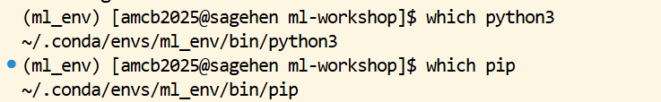

:::::::::::::::::::::::::::::::::::::: questions
- How do you create custom conda environments for ML?
- How do you create reproducible environments for team collaboration?
- What are common environment setup mistakes and how do you fix them?
- How do you keep environments small enough to fit your /rhome quota?
::::::::::::::::::::::::::::::::::::::::::::::::

::::::::::::::::::::::::::::::::::::: objectives
- Create and activate conda environments with GPU support
- Install PyTorch and TensorFlow with the correct CUDA version
- Export environments for reproducibility
- Troubleshoot the four most common environment problems
- Manage environment storage to stay within quota
::::::::::::::::::::::::::::::::::::::::::::::::

## Why Custom Environments Eventually Become Necessary

For rigorous environment management see Workshop 21 (Reproducible Research Pipelines).

Sagehen has no pre-built `pytorch` or `tensorflow` module, so a conda environment is not an optional upgrade — it is the only way to get either framework running. Conda environments also give you full control: pin every version, install anything from PyPI or conda-forge, and export the result for reproducibility.

The downside is disk space and complexity. Each ML environment can be 5 to 10 GB after `pytorch-cuda` and a few extras. Three or four large environments will eat your /rhome quota. The patterns below keep environments small, reproducible, and fast to recreate.

## Creating Custom Conda Environments

For projects requiring specific package versions or combinations:

### Step 1: Load Miniconda

```bash
module load miniconda3
```

### Step 2: Create Environment

```bash
# PyTorch with GPU support (recommended)
conda create -n pytorch_env python=3.11 \
  pytorch torchvision torchaudio \
  pytorch-cuda=12.1 \
  mkl==2021.4.0 pip \
  -c pytorch -c nvidia -y

# Or both frameworks together
conda create -n ml_both python=3.11 \
  pytorch torchvision torchaudio pytorch-cuda=12.1 \
  mkl==2021.4.0 pip pandas scikit-learn \
  -c pytorch -c nvidia -y
```

Three parts of that command are easy to leave out, and each causes a failure that is hard to diagnose later:

- **`python=3.11`** pins the interpreter. Without it, conda resolves whatever version it prefers and you can end up with an environment whose Python does not match the packages installed into it.
- **`mkl==2021.4.0`** pins Intel's Math Kernel Library to a known-good version. MKL 2024.1 and later dropped a symbol PyTorch's binary expects, so `import torch` fails with `ImportError: ... libtorch_cpu.so: undefined symbol: iJIT_NotifyEvent`. Confirmed on Sagehen — 2021.4.0 is the version verified working.
- **`pip`** installs pip *into the environment*. Without it, a later `python3 -m pip install` fails with `No module named pip`.

TensorFlow is best installed with pip inside an existing environment rather than through conda — TensorFlow's own documentation advises against the conda route:

```bash
conda activate pytorch_env
python3 -m pip install tensorflow[and-cuda]
```

The channel order matters. Channels are searched in priority order; `-c pytorch -c nvidia` puts the official PyTorch channel first, ensuring you get the correctly-built CUDA-enabled wheels rather than a CPU-only version that happens to share the same name on conda-forge.

### Step 3: Activate and Install Additional Packages

```bash
conda activate pytorch_env
conda install jupyter matplotlib seaborn -y
python3 -m pip install wandb tensorboard
```

Use `python3 -m pip`, never a bare `pip`. A bare `pip` can resolve to the one belonging to the loaded `miniconda3` module rather than the one inside your environment, silently installing packages into the wrong Python — the import then fails with `ModuleNotFoundError` even though the install reported success. If you are unsure which you are getting, check with `which python3` and `which pip`; both should point inside your environment directory.

::::::::::::::::::::::::::::::::::::: callout

## Mixing conda and pip safely

Conda and pip both install packages, but they manage dependencies differently. Mixing them can break things in subtle ways:

The safe pattern is conda first (for the framework and its CUDA dependencies), then pip last (for everything else). Doing it the other way around can cause conda to overwrite pip-installed packages on the next conda install.

If you must use pip for a specific package version that conda doesn't have, use it inside an already-active conda environment, and avoid running any further `conda install` after that.

::::::::::::::::::::::::::::::::::::::::::::::::

## Creating Reproducible Environments

### Export Environment

```bash
conda activate pytorch_env
conda env export > pytorch_env.yml

# Or, export only top-level packages (smaller, more portable)
conda env export --from-history > pytorch_env_minimal.yml
```

The full `conda env export` lists every package, including platform-specific transitive dependencies. The `--from-history` version is much smaller and lists only what you explicitly installed; conda fills in the dependencies on recreation. Use the minimal form for sharing across machines and the full form for exact reproduction.

### Recreate Environment

```bash
conda env create -f pytorch_env.yml
conda activate pytorch_env
```

If the environment file is the full export and you are on a different OS, recreation may fail because of OS-specific dependencies. The minimal form is more robust.

::::::::::::::::::::::::::::::::::::: challenge

**Challenge: Set Up a Team Environment**

Create a conda environment with PyTorch (GPU support), pandas, scikit-learn, matplotlib, and Jupyter. Then export it for teammates to use.

::::::::::::::::::::::::::::::::::::: solution

```bash
module load miniconda3

conda create -n research_ml \
  pytorch torchvision pytorch-cuda=12.1 \
  pandas scikit-learn matplotlib jupyter \
  -c pytorch -c nvidia -y

conda activate research_ml
conda env export --from-history > research_ml.yml

# Teammates install with:
# conda env create -f research_ml.yml
```

The `--from-history` flag produces a portable file that records what you actually asked for, not the OS-specific dependency tree.

::::::::::::::::::::::::::::::::::::::::::::::::
::::::::::::::::::::::::::::::::::::::::::::::::

## Troubleshooting Environment Problems

### Problem 1: "ModuleNotFoundError: No module named torch"

```bash
# Make sure conda environment is activated
conda activate pytorch_env

# Check Python version matches environment
which python3
```

{alt='Terminal with the ml_env conda environment active. The command which python3 returns a path inside the environment, ending in .conda/envs/ml_env/bin/python3, and which pip returns the matching pip inside the same environment directory rather than a system path.'}

If `which python3` shows `/usr/bin/python3`, conda is not activated. The fix is `conda activate pytorch_env`. If that fails, you forgot `module load miniconda3`.

### Problem 2: "torch.cuda.is_available() returns False"

```bash
# Check if GPU is detected
nvidia-smi

# Check if PyTorch can see GPU
python3 -c "import torch; print(torch.cuda.is_available())"

# If False, reinstall with correct CUDA version
conda install pytorch pytorch-cuda=12.1 -c pytorch -c nvidia -y
```

The most common cause is installing the CPU-only PyTorch by accident. Look for `pytorch-cpu` or `cpuonly` in `conda list`; if either is present, that is the problem. Reinstall with `pytorch-cuda=12.1` to force the GPU build.

The second most common cause is running on the login node. The login node has no GPU. Get an interactive GPU session first: `srun --partition=gpu --gres=gpu:1 --time=00:30:00 --pty bash`.

{alt='Terminal running srun with the gpu partition and one GPU requested. The shell prompt changes from the login node to a gpu node, and nvidia-smi then prints its table showing a single NVIDIA L40S card with roughly 46 gigabytes of memory, almost none in use, and no processes running on it.'}

### Problem 3: "CUDA/cuDNN version mismatch"

```bash
# Check CUDA version on system
nvidia-smi  # Should show CUDA 12.1

# Check PyTorch CUDA version
python3 -c "import torch; print(torch.version.cuda)"

# If mismatch, specify correct version
conda install pytorch pytorch-cuda=12.1 -c pytorch -c nvidia -y
```

The PyTorch CUDA toolkit must be less than or equal to the system CUDA driver version. `nvidia-smi` reports the driver capability; `torch.version.cuda` reports what PyTorch was built against. As long as PyTorch's CUDA is `<=` the driver's, things work.

### Problem 4: "/rhome quota exceeded"

```bash
# Check usage
du -sh /rhome/$USER/.conda/envs/* | sort -h

# Remove unused environments
conda env remove -n old_env_name
conda clean -a   # remove caches
```

Caches alone can be a few GB. `conda clean -a` is safe to run periodically.

::::::::::::::::::::::::::::::::::::: callout

**Environment Best Practices**
1. **One environment per project**: avoid dependency conflicts and version drift.
2. **Pin top-level versions explicitly**: `pytorch=2.1` is more reproducible than `pytorch`.
3. **Document requirements in the repo**: keep `environment.yml` with the code.
4. **Watch the quota**: `/rhome` is 100 GB and conda environments add up.
5. **Move large environments to /bigdata**: `conda config --add envs_dirs /bigdata/lab/<labname>/$USER/conda_envs` redirects future installs.
::::::::::::::::::::::::::::::::::::::::::::::::

::::::::::::::::::::::::::::::::::::: challenge

**Challenge: Diagnose a Failing Environment**

A teammate has a script that uses `from torch.utils.tensorboard import SummaryWriter`. They ran:

```bash
module load miniconda3
conda activate research_ml
python script.py
```

and got `ModuleNotFoundError: No module named 'tensorboard'`. The conda environment was created from the same `research_ml.yml` you exported. List two likely causes and the diagnostic command for each.

::::::::::::::::::::::::::::::::::::: solution

Cause 1: tensorboard was installed via pip in your original environment, but `conda env export --from-history` does not capture pip-installed packages. Diagnostic: `cat research_ml.yml` and look for a `pip:` section. If absent, that is the issue. Fix: add a `pip:` block listing tensorboard, or re-export with regular `conda env export` (which captures pip).

Cause 2: the teammate created the environment but did not install tensorboard. Diagnostic: `conda list -n research_ml | grep tensor`. If only torch is there, install with `pip install tensorboard`.

::::::::::::::::::::::::::::::::::::::::::::::::
::::::::::::::::::::::::::::::::::::::::::::::::

::::::::::::::::::::::::::::::::::::: keypoints
- Load miniconda3, then create environments with `conda create`
- Use `pytorch-cuda=12.1` when installing PyTorch for Sagehen's CUDA version
- Channel order in `conda create` matters; put `-c pytorch -c nvidia` first
- Mix conda and pip safely: conda first for frameworks, pip last for extras
- Export environments with `--from-history` for portability, full export for exact reproduction
- Common errors (missing CUDA, wrong versions, missing packages) are usually environment setup issues
- Watch /rhome quota; redirect conda to /bigdata if needed
- Store environment files in git repos for team consistency
::::::::::::::::::::::::::::::::::::::::::::::::

<!-- highlight <labname>/<myusername> placeholders in code blocks; remove if the varnish theme handles this natively -->
<script>(function(){var CSS='.sh-placeholder{color:#c2410c;font-weight:700}[data-bs-theme="dark"] .sh-placeholder,html.dark .sh-placeholder{color:#fdba74}@media (prefers-color-scheme: dark){[data-bs-theme="auto"] .sh-placeholder{color:#fdba74}}';var RX=/<labname>|<myusername>/g;function firstMatch(el){var w=document.createTreeWalker(el,NodeFilter.SHOW_TEXT,null),nodes=[],full='';while(w.nextNode()){nodes.push({n:w.currentNode,s:full.length});full+=w.currentNode.nodeValue;}RX.lastIndex=0;var m;while((m=RX.exec(full))){var s=m.index,e=s+m[0].length,inSpan=false,parts=[];for(var j=0;j<nodes.length;j++){var ns=nodes[j].s,ne=ns+nodes[j].n.nodeValue.length;if(ne<=s||ns>=e)continue;parts.push({node:nodes[j].n,a:Math.max(s-ns,0),b:Math.min(e-ns,nodes[j].n.nodeValue.length)});var p=nodes[j].n.parentNode;while(p&&p!==el){if(p.classList&&p.classList.contains('sh-placeholder')){inSpan=true;break;}p=p.parentNode;}}if(!inSpan&&parts.length)return parts;}return null;}function wrapParts(parts){for(var i=parts.length-1;i>=0;i--){var t=parts[i].node,txt=t.nodeValue,a=parts[i].a,b=parts[i].b;var span=document.createElement('span');span.className='sh-placeholder';span.textContent=txt.slice(a,b);var f=document.createDocumentFragment();if(a>0)f.appendChild(document.createTextNode(txt.slice(0,a)));f.appendChild(span);if(b<txt.length)f.appendChild(document.createTextNode(txt.slice(b)));t.parentNode.replaceChild(f,t);}}function run(){var st=document.createElement('style');st.textContent=CSS;document.head.appendChild(st);document.querySelectorAll('pre,code').forEach(function(el){var guard=0,parts;while((parts=firstMatch(el))&&guard++<500){wrapParts(parts);}});}if(document.readyState==='loading'){document.addEventListener('DOMContentLoaded',run);}else{run();}})();</script>
