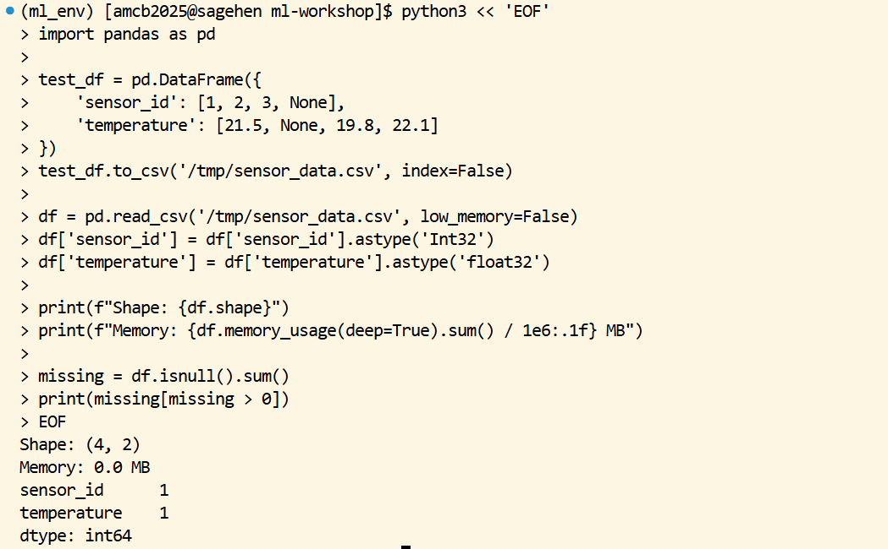

:::::::::::::::::::::::::::::::::::::: questions
- How do you efficiently prepare large datasets on HPC systems?
- What are best practices for handling missing values, normalization, and encoding?
- How do you avoid common data preparation pitfalls?
- When does pandas hit its limits, and what comes next?
::::::::::::::::::::::::::::::::::::::::::::::::

::::::::::::::::::::::::::::::::::::: objectives
- Understand data layout and I/O optimization on Sagehen HPC
- Handle missing values, normalize features, and encode categorical variables
- Avoid data leakage and class imbalance pitfalls
- Recognize when to graduate from pandas to Dask
::::::::::::::::::::::::::::::::::::::::::::::::

## The Data Preparation Bottleneck

In real ML workflows:

- **80% of project time** goes to data collection, cleaning, and preparation
- **Poor preprocessing** leads to worse model performance than poor algorithms
- **I/O bottlenecks** can make GPU training inefficient if data loading is slow

The preparation phase is where most projects die quietly. A model trained on subtly leaky data looks great on validation and falls apart in deployment. A model trained on imbalanced classes optimizes the majority class and ignores the minority class entirely. A model with the wrong feature scaling never converges. Each of these is fixable in 20 lines of preprocessing code, but only if you know to look.

## Data Placement Strategy on Sagehen HPC

For ML workflows on GPU nodes:

```
1. Store original data in /bigdata (persistent, accessible to all)
2. Copy training data subset to /scratch at job start (fast SSD access)
3. Process intermediate files to /scratch
4. Store final results back to /bigdata
```

I/O performance differs significantly across storage tiers:

```
/rhome:   ~50 MB/s   (BeeGFS, backed up)
/bigdata: ~200 MB/s  (BeeGFS parallel filesystem)
/scratch: ~1000 MB/s (node-local NVMe SSD, deleted when the job ends)
```

For a model that reads its dataset 50 epochs in a row, the difference between training off `/bigdata` and `/scratch` is the difference between hours and minutes. The pattern is to copy once at job start, train repeatedly against scratch, and write the final model back to `/bigdata`.

## Preprocessing with pandas

For datasets that fit in memory (< 50 GB on login node):

### Loading and Exploring Data

```python
import pandas as pd

df = pd.read_csv('/bigdata/lab/<labname>/datasets/sensor_data.csv',
                  low_memory=False,
                  dtype={'sensor_id': 'int32', 'temperature': 'float32'})

print(f"Shape: {df.shape}")
print(f"Memory: {df.memory_usage(deep=True).sum() / 1e6:.1f} MB")

# Check for missing data
missing = df.isnull().sum()
print(missing[missing > 0])
```

The explicit `dtype` argument is one of the cheapest performance optimizations available. By default, pandas reads numeric columns as `float64` (8 bytes per number). For most ML features, `float32` (4 bytes) is more than enough precision. On a 100-million-row dataset, that single change halves memory usage and roughly halves load time.

{alt='Terminal running a Python heredoc that builds a small pandas DataFrame with sensor_id and temperature columns containing deliberate None values, writes it to CSV, reads it back with explicit Int32 and float32 dtypes, then prints the DataFrame shape, its memory usage in megabytes, and a count of one missing value in each of the two columns.'}

### Handling Missing Values

```python
# Forward fill for time series
df['temperature'] = df['temperature'].ffill()

# Interpolation
df['sensor_reading'] = df['sensor_reading'].interpolate(method='linear')

# Mean/median imputation with sklearn
from sklearn.impute import SimpleImputer
imputer = SimpleImputer(strategy='mean')
df[numeric_cols] = imputer.fit_transform(df[numeric_cols])
```

The right strategy depends on the data. Forward fill makes sense for sensor data where missing values are gaps in a stream. Linear interpolation works for time series where neighboring values are smooth. Mean imputation is the safe default when you cannot make assumptions about the underlying process. Always document which strategy you chose and why; "missing values were handled" is not enough information for a reviewer.

### Normalization and Standardization

```python
from sklearn.preprocessing import StandardScaler, MinMaxScaler

# StandardScaler: (x - mean) / std
scaler = StandardScaler()
X_train_scaled = scaler.fit_transform(X_train)
X_test_scaled = scaler.transform(X_test)  # Use fit scaler, don't refit!
```

StandardScaler centers each column at zero and scales to unit variance, which is the right default for most neural networks and gradient-based methods. MinMaxScaler maps to [0, 1], which matters for image data (pixel values typically already 0-255 and you divide by 255).

The `fit_transform` on training data and `transform` on test data is the safe pattern. Calling `fit_transform` on test data is data leakage: you would be using test-set statistics in training, which inflates apparent accuracy.

### Handling Categorical Variables

```python
# One-hot encoding
df = pd.get_dummies(df, columns=['color', 'category'], drop_first=True)

# Label encoding (for tree-based models)
from sklearn.preprocessing import LabelEncoder
le = LabelEncoder()
df['species_encoded'] = le.fit_transform(df['species'])
```

Use one-hot encoding for nominal categories with no order (color, country, breed). Use label encoding for ordinal categories (rating: low/medium/high) and for tree-based models that handle integer encoding natively. Never use label encoding for nominal categories with linear models: it imposes a fake ordering on unordered categories.

The `drop_first=True` parameter avoids the dummy variable trap for linear models. With three colors (red, green, blue), one-hot encoding produces three columns; one is redundant because the third is implied by the first two. `drop_first` removes one to keep features linearly independent.

## Common Data Pitfalls

::::::::::::::::::::::::::::::::::::: callout

**Pitfall 1: Data Leakage** -- Never compute statistics on the entire dataset.

```python
# WRONG: leaks test data into training statistics
scaler.fit_transform(X_all_data)

# CORRECT: Fit on training data only
scaler.fit(X_train)
X_test_scaled = scaler.transform(X_test)
```

Data leakage is the single most common reason for "great validation, terrible production" outcomes. Any preprocessing that uses dataset-wide statistics (mean, std, max, min, percentiles, target encodings) must be fit on training data only.

**Pitfall 2: Forgetting to Save Your Scaler**

```python
import joblib
joblib.dump(scaler, '/bigdata/lab/<labname>/scaler.pkl')
scaler = joblib.load('/bigdata/lab/<labname>/scaler.pkl')
```

The fit scaler is part of your model. If you train with a scaler and deploy without it, your inputs at inference time are out of distribution and accuracy collapses. Save scaler (and any encoder, imputer, or other fit transformer) alongside the model checkpoint.

**Pitfall 3: Not Checking Class Imbalance**

```python
print(df['label'].value_counts(normalize=True))

from sklearn.utils.class_weight import compute_class_weight
weights = compute_class_weight('balanced', classes=np.unique(y), y=y)
```

A 99/1 imbalance produces a model with 99% accuracy that always predicts the majority class. Always check class balance before training; if it is skewed, decide whether to use class weights, oversample, undersample, or change the metric (F1 instead of accuracy).

::::::::::::::::::::::::::::::::::::::::::::::::

## When to Move Beyond pandas

Pandas is comfortable up to about 50 GB on a Sagehen `amd` node (which has 512 GB RAM, but you do not want to be the only thing running on a shared node). Beyond that:

For 50 to 500 GB datasets, switch to Dask (covered in episode 06). Dask uses pandas-like syntax but processes data in chunks and parallelizes across cores.

For 500 GB to multi-TB datasets, consider Apache Spark or similar distributed systems. These are heavier to set up but scale further.

For tabular ML specifically, consider Polars as a faster pandas alternative; it is single-node but much more memory-efficient and faster on most operations.

::::::::::::::::::::::::::::::::::::: challenge

**Challenge: Prepare a Sensor Dataset**

You have `/bigdata/lab/<labname>/datasets/sensor_data_raw.csv` with 1 million rows, some missing temperature values (2%), and a categorical status column (OK, WARNING, ERROR). Write a script that handles missing values, standardizes numeric features, and one-hot encodes the status column.

::::::::::::::::::::::::::::::::::::: solution

```python
import pandas as pd
import os
from sklearn.preprocessing import StandardScaler

df = pd.read_csv('/bigdata/lab/<labname>/datasets/sensor_data_raw.csv')
df['temperature'] = df['temperature'].interpolate(method='linear')
df = df.dropna()

scaler = StandardScaler()
numeric_cols = ['temperature', 'humidity', 'pressure']
df[numeric_cols] = scaler.fit_transform(df[numeric_cols])

df = pd.get_dummies(df, columns=['status'], drop_first=True)
df.to_csv(f'/scratch/{os.environ["USER"]}/sensor_data_clean.csv', index=False)
```

::::::::::::::::::::::::::::::::::::::::::::::::
::::::::::::::::::::::::::::::::::::::::::::::::

::::::::::::::::::::::::::::::::::::: challenge

**Challenge: Catch a Data-Leakage Bug**

Below is a colleague's preprocessing snippet. Identify the leakage and fix it.

```python
df = pd.read_csv('data.csv')
scaler = StandardScaler()
df[['x1', 'x2']] = scaler.fit_transform(df[['x1', 'x2']])

X = df[['x1', 'x2']]
y = df['label']
X_train, X_test, y_train, y_test = train_test_split(X, y, test_size=0.2)

model.fit(X_train, y_train)
print(model.score(X_test, y_test))
```

::::::::::::::::::::::::::::::::::::: solution

The scaler is fit on the entire dataset before the train/test split. Test-set statistics are leaking into the training preprocessing. Fix:

```python
df = pd.read_csv('data.csv')
X = df[['x1', 'x2']]
y = df['label']
X_train, X_test, y_train, y_test = train_test_split(X, y, test_size=0.2)

scaler = StandardScaler()
X_train_scaled = scaler.fit_transform(X_train)
X_test_scaled = scaler.transform(X_test)  # transform only, do not re-fit

model.fit(X_train_scaled, y_train)
print(model.score(X_test_scaled, y_test))
```

The fix moves all preprocessing inside the train/test boundary. In production code, wrap this in `sklearn.pipeline.Pipeline` so the pattern is enforced automatically.

::::::::::::::::::::::::::::::::::::::::::::::::
::::::::::::::::::::::::::::::::::::::::::::::::

::::::::::::::::::::::::::::::::::::: keypoints
- Use /scratch for intermediate ML data during jobs (4-7x faster than /bigdata)
- Specify dtypes when loading large CSVs to halve memory and load time
- Always split fit/transform between training and test data to avoid leakage
- Save preprocessing objects (scaler, encoder, imputer) alongside model checkpoints
- Check class balance before training; imbalance silently corrupts accuracy metrics
- pandas works well up to ~50 GB; switch to Dask above that
- Document the rationale for missing-value strategy, scaler choice, and encoding choice
::::::::::::::::::::::::::::::::::::::::::::::::

<!-- highlight <labname>/<myusername> placeholders in code blocks; remove if the varnish theme handles this natively -->
<script>(function(){var CSS='.sh-placeholder{color:#c2410c;font-weight:700}[data-bs-theme="dark"] .sh-placeholder,html.dark .sh-placeholder{color:#fdba74}@media (prefers-color-scheme: dark){[data-bs-theme="auto"] .sh-placeholder{color:#fdba74}}';var RX=/<labname>|<myusername>/g;function firstMatch(el){var w=document.createTreeWalker(el,NodeFilter.SHOW_TEXT,null),nodes=[],full='';while(w.nextNode()){nodes.push({n:w.currentNode,s:full.length});full+=w.currentNode.nodeValue;}RX.lastIndex=0;var m;while((m=RX.exec(full))){var s=m.index,e=s+m[0].length,inSpan=false,parts=[];for(var j=0;j<nodes.length;j++){var ns=nodes[j].s,ne=ns+nodes[j].n.nodeValue.length;if(ne<=s||ns>=e)continue;parts.push({node:nodes[j].n,a:Math.max(s-ns,0),b:Math.min(e-ns,nodes[j].n.nodeValue.length)});var p=nodes[j].n.parentNode;while(p&&p!==el){if(p.classList&&p.classList.contains('sh-placeholder')){inSpan=true;break;}p=p.parentNode;}}if(!inSpan&&parts.length)return parts;}return null;}function wrapParts(parts){for(var i=parts.length-1;i>=0;i--){var t=parts[i].node,txt=t.nodeValue,a=parts[i].a,b=parts[i].b;var span=document.createElement('span');span.className='sh-placeholder';span.textContent=txt.slice(a,b);var f=document.createDocumentFragment();if(a>0)f.appendChild(document.createTextNode(txt.slice(0,a)));f.appendChild(span);if(b<txt.length)f.appendChild(document.createTextNode(txt.slice(b)));t.parentNode.replaceChild(f,t);}}function run(){var st=document.createElement('style');st.textContent=CSS;document.head.appendChild(st);document.querySelectorAll('pre,code').forEach(function(el){var guard=0,parts;while((parts=firstMatch(el))&&guard++<500){wrapParts(parts);}});}if(document.readyState==='loading'){document.addEventListener('DOMContentLoaded',run);}else{run();}})();</script>
