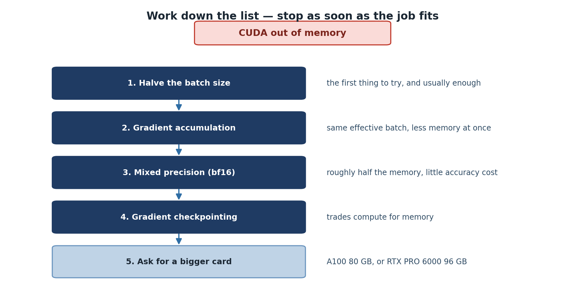

:::::::::::::::::::::::::::::::::::::: questions
- How do you set up PyTorch for GPU training on Sagehen HPC?
- What does an efficient training loop look like?
- How do you handle GPU memory errors?
- How do you choose between A100, L40S, and RTX PRO 6000 nodes for your job?
::::::::::::::::::::::::::::::::::::::::::::::::

::::::::::::::::::::::::::::::::::::: objectives
- Write efficient GPU training loops in PyTorch
- Use mixed precision training for speed and memory savings
- Diagnose and fix common GPU memory errors
- Pick the right Sagehen GPU type for your model size
- Save and resume from checkpoints across SLURM time limits
::::::::::::::::::::::::::::::::::::::::::::::::

## The GPUs You Will Actually Use

Sagehen hosts **10 GPUs total** across multiple nodes (confirmed by Andrew Wilson, May 2026): 4 NVIDIA A100 80 GB, 4 NVIDIA L40S 48 GB, and 2 NVIDIA RTX PRO 6000 96 GB. The differences matter when you submit jobs:

| GPU | VRAM | Best for | Limit |
|-----|------|----------|-------|
| A100 80 GB | 80 GB | Large models, large batches, long training runs | Highest demand, queue often |
| L40S 48 GB | 48 GB | Mid-size training, transformers, fine-tuning | Frequently available |
| RTX PRO 6000 | 96 GB ECC | Largest models, ECC-sensitive numerics, pro visualization | Often available |

If your model fits comfortably in 48 GB, prototype on an L40S first: they are the least contended GPUs on the cluster. The A100s are oversubscribed, and tying one up for exploratory work makes everyone else wait. For final long runs at scale, request A100 with `--gres=gpu:a100:1` in your SLURM script and budget for queue time.

{alt='Five responses to a CUDA out of memory error, in order. First halve the batch size, the first thing to try and usually enough. Second use gradient accumulation for the same effective batch with less memory at once. Third use mixed precision in bfloat16 for roughly half the memory at little accuracy cost. Fourth use gradient checkpointing, trading compute for memory. Fifth ask for a bigger card, an A100 80 GB or RTX PRO 6000 96 GB.'}

## GPU Memory Anatomy

Before writing the training loop, understand where memory goes. CUDA out-of-memory errors are the single most common failure mode for ML jobs on HPC, and they almost always come from misjudging this breakdown:

```
System RAM:  25 GB available per GPU job (configurable via --mem)
GPU VRAM:    Model weights + activations + gradients + optimizer state

Typical for ResNet-50 with batch size 256:
- Model weights:        ~100 MB
- Forward activations:  ~1500 MB   (largest, scales with batch size)
- Gradients:            ~100 MB    (same size as weights)
- Optimizer state:      ~100 MB    (Adam stores 2 copies per parameter)
- CUDA workspace:       ~500 MB    (cuDNN, kernels, fragmentation)
Total:                  ~2300 MB on GPU
```

The single biggest term is forward activations, and it scales linearly with batch size. Doubling the batch from 128 to 256 doubles activation memory but does not change weights, gradients, or optimizer state. If you hit OOM, halving batch size is almost always the right first move.

## Single-GPU Training Loop

```python
import torch
import torch.nn as nn
from torch.utils.data import DataLoader

# 1. Define model
model = nn.Sequential(
    nn.Linear(28 * 28, 128),
    nn.ReLU(),
    nn.Linear(128, 10)
)

# 2. Move model to GPU
device = torch.device('cuda' if torch.cuda.is_available() else 'cpu')
model = model.to(device)

# 3. Loss and optimizer
criterion = nn.CrossEntropyLoss()
optimizer = torch.optim.Adam(model.parameters(), lr=0.001)

# 4. Training loop
for epoch in range(10):
    for batch_idx, (data, target) in enumerate(train_loader):
        data, target = data.to(device, non_blocking=True), target.to(device, non_blocking=True)

        output = model(data)
        loss = criterion(output, target)

        optimizer.zero_grad()
        loss.backward()
        optimizer.step()

        if batch_idx % 100 == 0:
            print(f'Epoch {epoch} [{batch_idx}/{len(train_loader)}] Loss: {loss.item():.4f}')
```

Three small details in this loop matter for performance. First, `non_blocking=True` on `.to(device)` lets the host CPU continue while the copy runs asynchronously, which only helps when paired with `pin_memory=True` in the DataLoader. Second, `optimizer.zero_grad()` should come before the backward pass, not after the step; some tutorials get this wrong. Third, `loss.item()` forces a CUDA synchronization; calling it every batch is fine but doing more aggressive printing inside the loop hurts throughput.

::::::::::::::::::::::::::::::::::::: callout
**Always test on CPU or a tiny dataset first**

Spending an hour in the GPU queue only to crash with a shape mismatch on the first batch is demoralizing. Run your training script on the login node with a 100-sample dataset and `device='cpu'` until it completes one epoch without errors. Only then submit a real GPU job. Your future self will thank you.
::::::::::::::::::::::::::::::::::::::::::::::::

## GPU Memory Management

### Monitoring GPU Usage

Two views of GPU memory are useful: an external view from `nvidia-smi` and an internal view from PyTorch.

```bash
# In a second SSH session or terminal tab during a job
ssh sagehen.hpc.pomona.edu
ssh gpu001  # only works while you have an active job there
watch -n 1 nvidia-smi
```

```python
# Inside your training script
def print_gpu_memory():
    print(f"Allocated: {torch.cuda.memory_allocated() / 1e9:.2f} GB")
    print(f"Reserved:  {torch.cuda.memory_reserved() / 1e9:.2f} GB")
    print(f"Max alloc: {torch.cuda.max_memory_allocated() / 1e9:.2f} GB")
```

Allocated is what your tensors actually need. Reserved is the larger pool PyTorch holds onto for reuse. Max-allocated is the high-water mark since the last reset; this is the number that determines whether you OOM, not the current allocation.

### Fixing "CUDA out of memory"

The error message often blames the line where the OOM happened, but the root cause is usually upstream. Apply these fixes in order:

```python
# Fix 1: Reduce batch size (the big lever)
batch_size = 16  # halve it until OOM goes away

# Fix 2: Gradient accumulation simulates a larger effective batch
accumulation_steps = 4
optimizer.zero_grad()
for i, (data, target) in enumerate(train_loader):
    output = model(data.to(device))
    loss = criterion(output, target.to(device)) / accumulation_steps
    loss.backward()

    if (i + 1) % accumulation_steps == 0:
        optimizer.step()
        optimizer.zero_grad()
```

Gradient accumulation is the trick that lets a 48 GB L40S train models that would otherwise need an 80 GB A100. The math is clean: 4 micro-batches of size 8 produce the same gradients as one batch of size 32 (with one subtle caveat: batch normalization statistics are computed per micro-batch). Effective batch size is `batch_size * accumulation_steps`.

Other fixes worth knowing:

```python
# Fix 3: Free unused tensors explicitly
del intermediate_output
torch.cuda.empty_cache()  # returns reserved memory to the GPU pool

# Fix 4: Use checkpointing to trade compute for memory
from torch.utils.checkpoint import checkpoint
output = checkpoint(my_block, input_tensor)  # recompute activations during backward
```

`torch.utils.checkpoint` is most useful for transformer blocks and other deep networks where activations dominate memory. It re-runs the forward pass during backward, so you pay roughly 25% more compute for 30 to 50% less memory.

## Mixed Precision Training

Sagehen's A100 and L40S GPUs have dedicated tensor cores that run float16 and bfloat16 operations 2 to 4 times faster than float32. Mixed precision uses float16 for the bulk of computation and float32 only for the final weight update, where small numbers matter for numerical stability.

```python
from torch.cuda.amp import autocast, GradScaler

scaler = GradScaler()

for data, target in train_loader:
    data, target = data.to(device, non_blocking=True), target.to(device, non_blocking=True)

    with autocast(device_type='cuda', dtype=torch.float16):
        output = model(data)
        loss = criterion(output, target)

    scaler.scale(loss).backward()
    scaler.step(optimizer)
    scaler.update()
    optimizer.zero_grad()

# Results: ~2x faster on A100/L40S, uses ~50% memory, similar accuracy
```

The `GradScaler` is necessary because float16 has a narrow dynamic range. Multiplying loss by a large scale factor before backward keeps gradients out of the underflow region; the scaler unscales them before the optimizer step. If gradients overflow, the scaler skips that step and reduces the scale factor.

On all of Sagehen's GPUs (A100, L40S, and RTX PRO 6000), prefer `torch.bfloat16`. It is often more numerically stable than float16 because it has the same exponent range as float32 even though the mantissa is smaller. Bfloat16 does not need a `GradScaler`.

::::::::::::::::::::::::::::::::::::: callout
**Checkpointing across SLURM time limits**

The `gpu` partition on Sagehen does not have a published hard limit comparable to the `amd` 30-day, but in practice GPU jobs longer than 24 hours sit in queue indefinitely. Save checkpoints every epoch (or every N minutes) and structure your script to resume from the latest checkpoint:

```python
def save_checkpoint(model, optimizer, epoch, path):
    torch.save({
        'epoch': epoch,
        'model_state': model.state_dict(),
        'optimizer_state': optimizer.state_dict(),
    }, path)

def load_checkpoint(model, optimizer, path):
    if not os.path.exists(path):
        return 0
    ckpt = torch.load(path, map_location=device)
    model.load_state_dict(ckpt['model_state'])
    optimizer.load_state_dict(ckpt['optimizer_state'])
    return ckpt['epoch'] + 1
```

Write checkpoints to `/scratch` first (fast), then copy the final or best one to `/bigdata`. Hammering /bigdata with a checkpoint every 5 minutes is rude to your lab-mates who share the mount.
::::::::::::::::::::::::::::::::::::::::::::::::

::::::::::::::::::::::::::::::::::::: challenge

**Challenge: Train a CNN on CIFAR-10**

Write a training script that loads CIFAR-10, defines a simple CNN (2-3 conv layers), trains on GPU for 5 epochs, and prints GPU memory usage every 50 batches.

::::::::::::::::::::::::::::::::::::: solution

```python
import torch
import torch.nn as nn
import torchvision
from torchvision import transforms

transform = transforms.Compose([transforms.ToTensor(), transforms.Normalize((0.5,), (0.5,))])
train_data = torchvision.datasets.CIFAR10('/scratch', download=True, transform=transform)
train_loader = torch.utils.data.DataLoader(train_data, batch_size=128, shuffle=True,
                                            num_workers=4, pin_memory=True)

class SimpleCNN(nn.Module):
    def __init__(self):
        super().__init__()
        self.conv1 = nn.Conv2d(3, 32, 3, padding=1)
        self.conv2 = nn.Conv2d(32, 64, 3, padding=1)
        self.fc = nn.Linear(64 * 8 * 8, 10)

    def forward(self, x):
        x = torch.relu(self.conv1(x))
        x = torch.max_pool2d(x, 2)
        x = torch.relu(self.conv2(x))
        x = torch.max_pool2d(x, 2)
        x = x.view(x.size(0), -1)
        return self.fc(x)

device = torch.device('cuda')
model = SimpleCNN().to(device)
optimizer = torch.optim.Adam(model.parameters())
criterion = nn.CrossEntropyLoss()

for epoch in range(5):
    for batch_idx, (data, target) in enumerate(train_loader):
        data, target = data.to(device, non_blocking=True), target.to(device, non_blocking=True)
        optimizer.zero_grad()
        loss = criterion(model(data), target)
        loss.backward()
        optimizer.step()

        if batch_idx % 50 == 0:
            print(f'Epoch {epoch} [{batch_idx}] Loss: {loss.item():.4f}')
            print(f'GPU memory: {torch.cuda.memory_allocated() / 1e9:.2f} GB')
```

Note that CIFAR-10 downloads to `/scratch`, not your home directory. Downloading 170 MB to `/rhome` every job is rude when /scratch exists.

::::::::::::::::::::::::::::::::::::::::::::::::
::::::::::::::::::::::::::::::::::::::::::::::::

::::::::::::::::::::::::::::::::::::: challenge

**Challenge: Diagnose an OOM**

A graduate student submits a training job that fails with `CUDA out of memory: tried to allocate 4.2 GB`. They are using `--gres=gpu:l40s:1` (48 GB), batch size 256, and a ResNet-152 model with bfloat16 mixed precision. List three diagnostic steps and the most likely fix.

::::::::::::::::::::::::::::::::::::: solution

1. Check `torch.cuda.max_memory_allocated()` from a small test run to estimate the high-water mark. ResNet-152 at batch 256 with mixed precision needs roughly 45 to 50 GB on an L40S, leaving no headroom at all.

2. Confirm whether the GPU is shared. `nvidia-smi` should show only this job's process; if there is another tenant, request a different GPU, such as `--gres=gpu:a100:1`, instead.

3. Check whether mixed precision is actually engaged. If `autocast` is missing or scoped wrong, the model runs in float32 and uses 2x the memory.

Most likely fix: drop batch size to 128 and use gradient accumulation with `accumulation_steps=2` to recover the effective batch size of 256. This trades a small throughput hit for fitting the model on the L40S.

::::::::::::::::::::::::::::::::::::::::::::::::
::::::::::::::::::::::::::::::::::::::::::::::::

::::::::::::::::::::::::::::::::::::: keypoints
- Sagehen has 10 GPUs across three types (A100 80 GB, L40S 48 GB, RTX PRO 6000 96 GB); pick the right one for your job
- Move data and models to GPU using `.to(device, non_blocking=True)` paired with pinned-memory DataLoader
- Forward activations dominate GPU memory and scale with batch size
- Mixed precision gives ~2x speed and ~50% memory on A100/L40S; bfloat16 is more stable than float16
- Gradient accumulation simulates large batches when memory is tight
- Always checkpoint to /scratch and copy final results to /bigdata
- Test on CPU or a tiny dataset before submitting a real GPU job
::::::::::::::::::::::::::::::::::::::::::::::::
