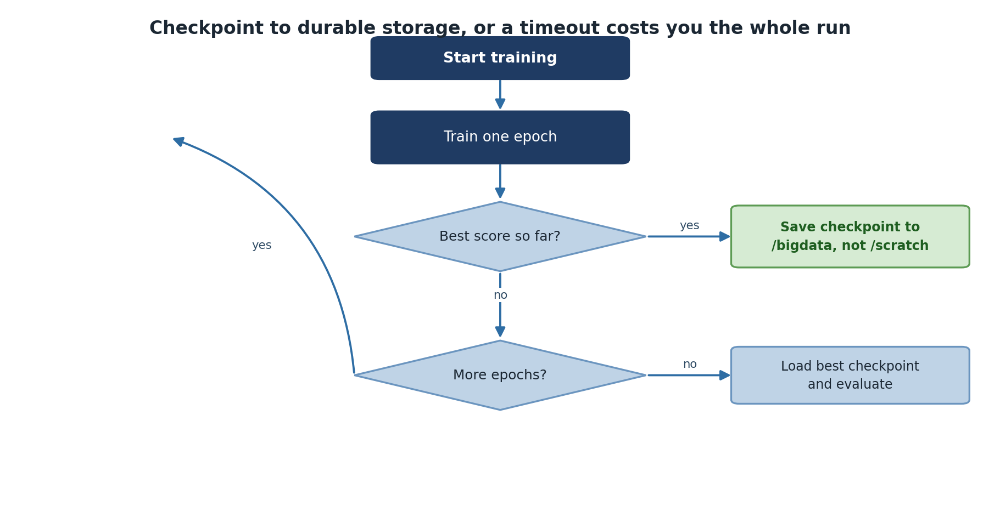

:::::::::::::::::::::::::::::::::::::: questions
- How do you save and resume long-running training jobs?
- What should a complete checkpoint include?
- How do you implement multi-GPU training on Sagehen HPC?
- How often should you checkpoint, and where should checkpoints live?
::::::::::::::::::::::::::::::::::::::::::::::::

::::::::::::::::::::::::::::::::::::: objectives
- Implement checkpointing for long training jobs
- Save and restore complete training state
- Choose the right checkpoint cadence and storage location
- Understand data parallelism for multi-GPU training
::::::::::::::::::::::::::::::::::::::::::::::::

## Why Checkpointing Matters

GPU jobs on Sagehen can run for many hours, and time-limit boundaries, hardware faults, queue evictions, and your own bugs can interrupt training at any point. Without checkpoints, an interruption at hour 23 of a 24-hour run loses everything. With checkpoints saved every 30 minutes, you lose at most 30 minutes of work and resume from the last good state.

Checkpointing is also the foundation for two other patterns: hyperparameter sweeps that need to fork from a common pretrained state, and analysis runs that need to inspect a model at multiple points in training to understand its learning dynamics.

{alt='A training loop. Start training, train one epoch, and ask whether this is the best score so far. If it is, save a checkpoint to /bigdata rather than /scratch. Then ask whether there are more epochs; if so, loop back to train another, and if not, load the best checkpoint and evaluate.'}

## What Goes In a Checkpoint

A complete checkpoint must contain enough state to resume training without changing the result. At minimum:

- Model weights (`model.state_dict()`)
- Optimizer state (momentum, Adam moments, etc.)
- Current epoch and iteration
- Random number generator state if exact reproducibility matters
- Hyperparameters used (so you can verify on resume)
- Best validation metric so far (so the next checkpoint knows whether to overwrite)

Saving only model weights, which many tutorials do, is enough for inference but loses the optimizer state. Resuming after that gives subtly different training trajectories, which is fine for casual experiments but bad for reproducible research.

## PyTorch Checkpointing

### Saving Complete Checkpoints

```python
import torch
import os

def scratch_checkpoint_dir():
    """Fast, node-local, and gone when this job ends."""
    return os.path.join('/scratch', os.environ['USER'],
                        os.environ.get('SLURM_JOB_ID', 'interactive'), 'checkpoints')

class ModelTrainer:
    def __init__(self, model, device, checkpoint_dir=None):
        self.model = model.to(device)
        self.device = device
        self.checkpoint_dir = checkpoint_dir or scratch_checkpoint_dir()
        os.makedirs(self.checkpoint_dir, exist_ok=True)

    def save_checkpoint(self, epoch, optimizer, loss):
        checkpoint = {
            'epoch': epoch,
            'model_state': self.model.state_dict(),
            'optimizer_state': optimizer.state_dict(),
            'loss': loss
        }
        path = os.path.join(self.checkpoint_dir, f'checkpoint_epoch_{epoch}.pt')
        torch.save(checkpoint, path)
        print(f"Saved checkpoint: {path}")

    def load_checkpoint(self, path, optimizer=None):
        checkpoint = torch.load(path, map_location=self.device)
        self.model.load_state_dict(checkpoint['model_state'])
        if optimizer:
            optimizer.load_state_dict(checkpoint['optimizer_state'])
        return checkpoint['epoch']
```

The `map_location=self.device` argument matters when reloading: a checkpoint saved on `gpu001` can be loaded on `gpu003` only if you re-map the device. Without it, PyTorch tries to put tensors on the exact GPU index they were saved from, which may not exist on a different node.

### Training with Periodic Checkpoints

```python
trainer = ModelTrainer(model, device)
for epoch in range(num_epochs):
    train_loss = trainer.train_epoch(train_loader, criterion, optimizer)
    val_loss = trainer.validate(val_loader, criterion)
    print(f'Epoch {epoch}: train={train_loss:.4f}, val={val_loss:.4f}')

    # Save every 2 epochs
    if epoch % 2 == 0:
        trainer.save_checkpoint(epoch, optimizer, val_loss)
```

::::::::::::::::::::::::::::::::::::: callout

## How often to checkpoint

The right cadence balances three things: how much work loss is acceptable, how much disk space checkpoints consume, and how much time saving costs.

For typical neural network training, save every epoch and keep only the best (by validation loss) plus the latest. Two checkpoint files at any time, fixed disk usage, near-zero work loss.

For very fast epochs (under a minute), checkpoint every N epochs instead.

For very slow epochs (over an hour), checkpoint mid-epoch using `torch.save` calls inside the training loop on a step-count condition.

For the largest models where each checkpoint is many GB, save to `/scratch` during the run and only move the final or best to `/bigdata`. Hammering the shared BeeGFS filesystem with frequent multi-GB writes slows the cluster down for everyone.

::::::::::::::::::::::::::::::::::::::::::::::::

### Resuming from Checkpoint

```python
# Resume training
checkpoint = torch.load('checkpoint_epoch_50.pt', map_location=device)
model.load_state_dict(checkpoint['model_state'])
optimizer.load_state_dict(checkpoint['optimizer_state'])
start_epoch = checkpoint['epoch'] + 1

for epoch in range(start_epoch, num_epochs):
    train_one_epoch(model, train_loader, optimizer, criterion)
```

A safe pattern is to wrap this in a "resume if checkpoint exists" check at the top of the script. The same script then handles both fresh starts and resumes:

```python
import glob

ckpts = sorted(glob.glob(f'{checkpoint_dir}/checkpoint_epoch_*.pt'))
if ckpts:
    last = ckpts[-1]
    print(f"Resuming from {last}")
    ckpt = torch.load(last, map_location=device)
    model.load_state_dict(ckpt['model_state'])
    optimizer.load_state_dict(ckpt['optimizer_state'])
    start_epoch = ckpt['epoch'] + 1
else:
    start_epoch = 0
```

This makes the SLURM script restartable: submit again with the same script and it picks up where it left off.

## Multi-GPU Training Overview

When single-GPU training takes too long, data parallelism distributes batches across GPUs:

### PyTorch DistributedDataParallel

```python
import torch.distributed as dist
from torch.utils.data import DistributedSampler

def train_distributed(rank, world_size):
    dist.init_process_group(backend='nccl', rank=rank, world_size=world_size)
    torch.cuda.set_device(rank)

    model = MyModel().cuda(rank)
    model = torch.nn.parallel.DistributedDataParallel(model, device_ids=[rank])

    sampler = DistributedSampler(train_dataset, num_replicas=world_size, rank=rank)
    dataloader = DataLoader(train_dataset, sampler=sampler, batch_size=batch_size // world_size)

    for epoch in range(num_epochs):
        for data, target in dataloader:
            data, target = data.cuda(rank), target.cuda(rank)
            optimizer.zero_grad()
            loss = criterion(model(data), target)
            loss.backward()
            optimizer.step()

        if rank == 0:
            torch.save(model.module.state_dict(), f'checkpoint_{epoch}.pt')

    dist.destroy_process_group()
```

Three things in this snippet are important and easy to miss. The `nccl` backend is the right choice for Sagehen GPU nodes (NVIDIA's collective communication library, much faster than `gloo` on GPUs). `DistributedSampler` ensures each rank sees a different slice of the dataset; without it, all ranks process the same data and you get no speedup. Saving only on rank 0 (`if rank == 0:`) prevents N ranks from all writing the same checkpoint to disk simultaneously.

### TensorFlow Multi-GPU

```python
strategy = tf.distribute.MirroredStrategy()
with strategy.scope():
    model = tf.keras.Sequential([...])
    model.compile(optimizer='adam', loss='sparse_categorical_crossentropy')
model.fit(dataset, epochs=10)  # Automatically distributed
```

TensorFlow's `MirroredStrategy` handles the same pattern with much less boilerplate. The `with strategy.scope()` block must wrap model creation and compilation; `fit` then automatically splits batches and averages gradients.

::::::::::::::::::::::::::::::::::::: callout

## Multi-GPU on Sagehen HPC: when is it worth it?

Sagehen GPU nodes typically host 2 GPUs. Going from 1 to 2 GPUs gives 1.6 to 1.9x speedup, not 2x, because of communication overhead and uneven batch boundaries.

Use multi-GPU when:

- A single GPU cannot fit your batch size, even with gradient accumulation.
- You have demonstrated wall-clock pressure (a multi-day single-GPU run that you need to halve).
- Your dataset is large enough that even halved per-GPU batches still keep both GPUs busy.

Avoid multi-GPU when:

- The single-GPU baseline trains in a few hours. The complexity is not worth the small speedup.
- Your model is tiny and the dominant cost is not GPU compute.
- You have not first tried mixed precision (fp16/bf16), which often gives a similar speedup with no code complexity.

::::::::::::::::::::::::::::::::::::::::::::::::

::::::::::::::::::::::::::::::::::::: challenge

**Challenge: Add Checkpointing to a Training Script**

Modify a training loop to save checkpoints every 5 epochs, including model weights, optimizer state, epoch number, and validation loss. Then write the code to resume from the latest checkpoint.

::::::::::::::::::::::::::::::::::::: solution

```python
import glob, os, re, shutil

# Fast working copy: node-local, disappears when this job ends
SCRATCH_CKPT = os.path.join('/scratch', os.environ['USER'],
                            os.environ.get('SLURM_JOB_ID', 'interactive'), 'checkpoints')
# Durable copy: survives the job, so the *next* submission can find it
DURABLE_CKPT = '/bigdata/lab/<labname>/checkpoints/myproject'

os.makedirs(SCRATCH_CKPT, exist_ok=True)
os.makedirs(DURABLE_CKPT, exist_ok=True)

def save_checkpoint(model, optimizer, epoch, val_loss):
    name = f'checkpoint_{epoch:04d}.pt'
    local = os.path.join(SCRATCH_CKPT, name)
    torch.save({
        'epoch': epoch,
        'model_state': model.state_dict(),
        'optimizer_state': optimizer.state_dict(),
        'val_loss': val_loss
    }, local)
    # Promote it immediately: /scratch will not exist after this job
    shutil.copy2(local, os.path.join(DURABLE_CKPT, name))

# Resume from the DURABLE location, not /scratch --- a requeued job almost
# certainly lands on a different node, where /scratch is empty.
checkpoints = sorted(glob.glob(os.path.join(DURABLE_CKPT, 'checkpoint_*.pt')))
if checkpoints:
    ckpt = torch.load(checkpoints[-1])
    model.load_state_dict(ckpt['model_state'])
    optimizer.load_state_dict(ckpt['optimizer_state'])
    start_epoch = ckpt['epoch'] + 1
    print(f"Resuming from {checkpoints[-1]} at epoch {start_epoch}")
else:
    start_epoch = 0
    print("No checkpoint found --- starting from epoch 0")

for epoch in range(start_epoch, 100):
    train_loss = train_one_epoch(model, train_loader, optimizer, criterion)
    val_loss = validate(model, val_loader, criterion)
    if epoch % 5 == 0:
        save_checkpoint(model, optimizer, epoch, val_loss)
```

Two details worth copying into your own code. The filename is zero-padded
(`checkpoint_0007.pt`), because `sorted()` on unpadded names puts `checkpoint_10.pt`
before `checkpoint_9.pt` and you resume from the wrong epoch. And the resume path
prints what it found — a restart that silently begins at epoch 0 looks exactly like a
normal start in the logs, and you will not notice until you have burned another day of
GPU time.

::::::::::::::::::::::::::::::::::::::::::::::::
::::::::::::::::::::::::::::::::::::::::::::::::

::::::::::::::::::::::::::::::::::::: challenge

**Challenge: Plan a Restartable Long Job**

You need to train a model that takes ~36 hours on a single A100. List your plan: where checkpoints live, how often to save, what SLURM directives to use, and what command actually starts/restarts the job.

::::::::::::::::::::::::::::::::::::: solution

Plan:

- Checkpoints written to `/scratch/$USER/$SLURM_JOB_ID/checkpoints/` during training and copied to `/bigdata/lab/<labname>/checkpoints/PROJECT/` as each one is written — not only at the end, because a job killed by timeout never reaches the end.
- Save every epoch; keep only the latest and the best (by validation loss).
- SLURM directives: `--partition=gpu --gres=gpu:a100:1 --time=24:00:00`. Submit twice (or use `--dependency=afterany:JOBID` to chain).
- Script resumes from the newest checkpoint in `/bigdata`, **not** `/scratch`. The second submission will land on a different node, where `/scratch` is empty — resuming from there would silently restart training at epoch 0 and waste the entire first run.
- Use `#SBATCH --signal=B:USR1@600` and a trap to copy checkpoints back if the job is killed by timeout.

This pattern survives a single 24-hour limit but completes a 36-hour run in two queue cycles.

::::::::::::::::::::::::::::::::::::::::::::::::
::::::::::::::::::::::::::::::::::::::::::::::::

::::::::::::::::::::::::::::::::::::: keypoints
- Save checkpoints periodically to recover from interruptions, time limits, or hardware faults
- Include model state, optimizer state, epoch, and best validation loss in checkpoints
- Use `map_location` when loading checkpoints across different GPU nodes
- A "resume if checkpoint exists" pattern makes scripts restartable from any point
- Save checkpoints to /scratch during the run, copy final to /bigdata at end
- DistributedDataParallel is the recommended approach for multi-GPU PyTorch
- TensorFlow MirroredStrategy handles distribution with much less boilerplate
- Save checkpoints only on rank 0 in distributed training
- Multi-GPU is worth ~1.7x; try mixed precision first for similar speedup with no complexity
::::::::::::::::::::::::::::::::::::::::::::::::

<!-- highlight <labname>/<myusername> placeholders in code blocks; remove if the varnish theme handles this natively -->
<script>(function(){var CSS='.sh-placeholder{color:#c2410c;font-weight:700}[data-bs-theme="dark"] .sh-placeholder,html.dark .sh-placeholder{color:#fdba74}@media (prefers-color-scheme: dark){[data-bs-theme="auto"] .sh-placeholder{color:#fdba74}}';var RX=/<labname>|<myusername>/g;function firstMatch(el){var w=document.createTreeWalker(el,NodeFilter.SHOW_TEXT,null),nodes=[],full='';while(w.nextNode()){nodes.push({n:w.currentNode,s:full.length});full+=w.currentNode.nodeValue;}RX.lastIndex=0;var m;while((m=RX.exec(full))){var s=m.index,e=s+m[0].length,inSpan=false,parts=[];for(var j=0;j<nodes.length;j++){var ns=nodes[j].s,ne=ns+nodes[j].n.nodeValue.length;if(ne<=s||ns>=e)continue;parts.push({node:nodes[j].n,a:Math.max(s-ns,0),b:Math.min(e-ns,nodes[j].n.nodeValue.length)});var p=nodes[j].n.parentNode;while(p&&p!==el){if(p.classList&&p.classList.contains('sh-placeholder')){inSpan=true;break;}p=p.parentNode;}}if(!inSpan&&parts.length)return parts;}return null;}function wrapParts(parts){for(var i=parts.length-1;i>=0;i--){var t=parts[i].node,txt=t.nodeValue,a=parts[i].a,b=parts[i].b;var span=document.createElement('span');span.className='sh-placeholder';span.textContent=txt.slice(a,b);var f=document.createDocumentFragment();if(a>0)f.appendChild(document.createTextNode(txt.slice(0,a)));f.appendChild(span);if(b<txt.length)f.appendChild(document.createTextNode(txt.slice(b)));t.parentNode.replaceChild(f,t);}}function run(){var st=document.createElement('style');st.textContent=CSS;document.head.appendChild(st);document.querySelectorAll('pre,code').forEach(function(el){var guard=0,parts;while((parts=firstMatch(el))&&guard++<500){wrapParts(parts);}});}if(document.readyState==='loading'){document.addEventListener('DOMContentLoaded',run);}else{run();}})();</script>
