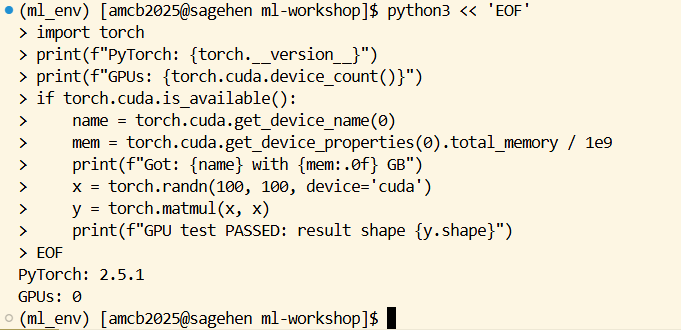

:::::::::::::::::::::::::::::::::::::: questions
- How do you load ML modules on Sagehen HPC?
- What pre-built modules are available for PyTorch and TensorFlow?
- How do you verify GPU access is working?
- When should you reuse a shared conda environment vs. build your own?
::::::::::::::::::::::::::::::::::::::::::::::::

::::::::::::::::::::::::::::::::::::: objectives
- Load modules and prepare Sagehen for ML work
- Activate a working PyTorch or TensorFlow conda environment
- Verify CUDA and GPU availability
- Decide when to reuse an existing environment and when to build your own
::::::::::::::::::::::::::::::::::::::::::::::::

## Why Environment Setup Is the First Real Hurdle

Before any model trains, you have to get a Python interpreter, the right framework, the right CUDA libraries, and the right cuDNN version all agreeing with each other. On a personal laptop this is annoying. On a shared HPC cluster, where you cannot just `pip install` system-wide and where the GPU driver is fixed by ITS, it is the single most common failure point for new users.

Sagehen has no `pytorch` or `tensorflow` module — Lmod provides the supporting pieces (`miniconda3`, `cuda`), and the framework itself always comes from a conda environment. So the real choice is between reusing an environment someone in your lab already built and building your own. Start by reusing one to confirm the GPU path works end to end, then build your own once you need specific versions or extra packages.

## Understanding Sagehen HPC's Module System

Sagehen uses Lmod (a module system) to manage software versions. Modules provide pre-configured environments without cluttering your shell. Each module sets `PATH`, `LD_LIBRARY_PATH`, and other environment variables for one specific tool, and `module unload` cleanly reverses those changes.

### View Available Modules

```bash
# List all available modules
module avail

# List modules containing "python" or "cuda"
module avail python
module avail cuda

# Get detailed info about a module
module show cuda/12.2.1
```

`module show` is underused. It tells you exactly which CUDA version a framework module loads, which `PATH` entries it adds, and which other modules it depends on. Reading this once for `cuda/12.2.1` makes the whole "why doesn't my framework see the GPU" debugging conversation 10 times faster.

### Loading Modules

Verify the actual Lmod tree with `module spider cuda` for the versions currently available on Sagehen.

```bash
# Load a single module
module load miniconda3

# Load multiple modules
module load miniconda3 cuda/12.2.1

# Check what's loaded
module list

# Remove a module
module unload cuda/12.2.1

# Clear all modules
module purge
```

::::::::::::::::::::::::::::::::::::: callout

## Module loading inside SLURM scripts

Modules loaded in your interactive shell do **not** carry into a SLURM job. You must explicitly load them inside the batch script:

```bash
#!/bin/bash
#SBATCH --partition=gpu
#SBATCH --gres=gpu:1

module purge
module load miniconda3 cuda/12.2.1
conda activate pytorch_env   # created in the next episode

python train.py
```

Including `module purge` first is a habit worth forming: it ensures the script starts from a known clean state and is not affected by whatever happened to be loaded in the submitting shell.

::::::::::::::::::::::::::::::::::::::::::::::::

## Quick Start: Getting a Framework Running

Neither framework ships as a module, so both come from conda. The fastest start is to activate an environment that already exists — the commands below assume `pytorch_env` and `tf_env` have been created as described in the next episode.

### Option 1: PyTorch

```bash
# PyTorch comes from a conda environment -- there is no pytorch module.
# The cuda module supplies the GPU toolkit; conda's pytorch bundles cuDNN.
module load miniconda3 cuda/12.2.1
conda activate pytorch_env

# Test it works
python3 << 'EOF'
import torch
print(f"PyTorch version: {torch.__version__}")
print(f"CUDA available: {torch.cuda.is_available()}")
print(f"CUDA version: {torch.version.cuda}")
print(f"Number of GPUs: {torch.cuda.device_count()}")

if torch.cuda.is_available():
    print(f"GPU Name: {torch.cuda.get_device_name(0)}")
EOF
```

### Option 2: TensorFlow

```bash
conda activate tf_env   # TensorFlow env (see next episode) -- no tensorflow module exists
python3 -c "import tensorflow as tf; print(f'GPUs: {len(tf.config.list_physical_devices(\"GPU\"))}')"
```

### Verifying Your Environment

After loading modules, test all components:

```python
import torch

print(f"PyTorch Version: {torch.__version__}")
print(f"CUDA Available: {torch.cuda.is_available()}")
print(f"CUDA Version: {torch.version.cuda}")

gpu_count = torch.cuda.device_count()
print(f"Number of GPUs: {gpu_count}")

if gpu_count > 0:
    for i in range(gpu_count):
        props = torch.cuda.get_device_properties(i)
        print(f"GPU {i}: {props.name}, Memory: {props.total_memory / 1e9:.1f} GB")

# Quick computation test
if torch.cuda.is_available():
    x = torch.randn(1000, 1000, device='cuda')
    y = torch.randn(1000, 1000, device='cuda')
    z = torch.matmul(x, y)
    print(f"GPU computation test: PASSED (result shape: {z.shape})")
```

{alt='Terminal on Sagehen HPC inside the ml_env conda environment. A heredoc runs a Python script that imports torch and prints the PyTorch version, whether CUDA is available, the CUDA version, and the number of GPUs, then loops over each GPU printing its name and total memory in gigabytes.'}

The GPU name in the output tells you which Sagehen GPU you got. Sagehen has a heterogeneous GPU pool of 10 GPUs total (confirmed May 2026): 4× A100 80 GB, 4× L40S 48 GB, and 2× RTX PRO 6000 96 GB. Without a `--gres` constraint, SLURM hands you whatever is free first.

## When to Reuse an Environment vs. Build Your Own

::::::::::::::::::::::::::::::::::::: callout

## Decision rubric

Reuse an existing environment when:

- You are getting started and just want something working today.
- Your lab already maintains one with the versions your project needs.
- You do not need packages beyond what it already contains.

Roll your own conda environment when:

- You need a specific framework version the shared environment does not have.
- Your project has many extra dependencies (transformers, scikit-learn, custom packages).
- You need to share an environment file with collaborators for reproducibility.
- You need to mix two frameworks (e.g., PyTorch + TensorFlow + JAX).

Most serious research projects end up with their own environment. A shared one is best as a quick-start tool and as a fallback when your own is broken.

::::::::::::::::::::::::::::::::::::::::::::::::

## Where Conda Lives on Sagehen HPC

When you run `conda create -n myenv ...`, the environment is stored under `/rhome/$USER/.conda/envs/myenv`. Each environment with a deep learning framework can easily reach 5 to 10 GB. Your `/rhome` quota is 100 GB. Three or four large ML environments will fill it.

To check your usage:

```bash
du -sh /rhome/$USER/.conda/envs/* 2>/dev/null | sort -h
```

If you are bumping into the quota, two options: prune unused environments with `conda env remove -n old_env`, or reconfigure conda to store environments under your lab's `/bigdata` allocation:

```bash
conda config --add envs_dirs /bigdata/lab/<labname>/$USER/conda_envs
```

{alt='Terminal output of du -sh over the conda envs directory, sorted by size: a 28 megabyte myproject environment, a 62 megabyte tb_test environment, and a 7.0 gigabyte ml_env environment. Below, conda config --add envs_dirs adds a /bigdata path, and conda config --show envs_dirs lists the new /bigdata location ahead of the default /rhome and system miniconda3 directories.'}

::::::::::::::::::::::::::::::::::::: challenge

**Challenge: Verify Your GPU Setup**

Activate a PyTorch environment on a GPU node, then write and run a script that:
1. Prints the PyTorch version
2. Checks how many GPUs are available
3. Identifies the GPU type (A100, L40S, or RTX PRO 6000)
4. Runs a small matrix multiplication on GPU and verifies the result

::::::::::::::::::::::::::::::::::::: solution

```bash
srun --partition=gpu --gres=gpu:1 --time=00:10:00 --pty bash

module purge
module load miniconda3
conda activate pytorch_env

python3 << 'EOF'
import torch
print(f"PyTorch: {torch.__version__}")
print(f"GPUs: {torch.cuda.device_count()}")
if torch.cuda.is_available():
    name = torch.cuda.get_device_name(0)
    mem = torch.cuda.get_device_properties(0).total_memory / 1e9
    print(f"Got: {name} with {mem:.0f} GB")
    x = torch.randn(100, 100, device='cuda')
    y = torch.matmul(x, x)
    print(f"GPU test PASSED: result shape {y.shape}")
EOF
```

{alt='Terminal running the challenge solution as a Python heredoc. It prints the PyTorch version 2.5.1, the GPU count, the GPU name and memory, then performs a matrix multiplication on the CUDA device and reports that the GPU test passed with the resulting tensor shape.'}

The interactive `srun` is important: you must be on a GPU node, not the login node, to see a GPU. The `name` output reveals which of the three Sagehen GPU types you got.

::::::::::::::::::::::::::::::::::::::::::::::::
::::::::::::::::::::::::::::::::::::::::::::::::

::::::::::::::::::::::::::::::::::::: challenge

**Challenge: When the System Module Won't Do**

A research collaborator sends you their codebase, which requires `torch==2.3.1` and `transformers==4.38`. Your lab's shared environment has an older PyTorch. Sketch the steps you would take to set up a working environment without breaking anyone else's.

::::::::::::::::::::::::::::::::::::: solution

1. Load the conda module: `module load miniconda3`.
2. Create an environment with the exact versions: `conda create -n collab_proj python=3.11 pytorch=2.3.1 pytorch-cuda=12.1 -c pytorch -c nvidia -y`.
3. Activate and install transformers: `conda activate collab_proj; pip install transformers==4.38`.
4. Verify the GPU works: load the env in an interactive `srun --gres=gpu:1` session and run the verification script above.
5. Export for reproducibility: `conda env export > environment.yml` and commit to the project repo.

This isolates the collaborator's exact stack in your own environment without touching the shared one other users depend on.

::::::::::::::::::::::::::::::::::::::::::::::::
::::::::::::::::::::::::::::::::::::::::::::::::

::::::::::::::::::::::::::::::::::::: keypoints
- `module load miniconda3`, then `conda activate` an existing environment, is the quickest way to start
- `module show NAME` reveals what a module actually does (CUDA version, dependencies)
- Always re-load modules inside SLURM scripts; the login-node environment does not transfer
- Sagehen's GPU driver reports CUDA 12.7; the newest CUDA *toolkit* module is `cuda/12.2.1`. They are different things and do not need to match
- Always test GPU access with small verification scripts before large jobs
- Roll your own conda environment when you need pinned versions or extra packages
- Conda environments can be moved to /bigdata if /rhome quota gets tight
::::::::::::::::::::::::::::::::::::::::::::::::

<!-- highlight <labname>/<myusername> placeholders in code blocks; remove if the varnish theme handles this natively -->
<script>(function(){var CSS='.sh-placeholder{color:#c2410c;font-weight:700}[data-bs-theme="dark"] .sh-placeholder,html.dark .sh-placeholder{color:#fdba74}@media (prefers-color-scheme: dark){[data-bs-theme="auto"] .sh-placeholder{color:#fdba74}}';var RX=/<labname>|<myusername>/g;function firstMatch(el){var w=document.createTreeWalker(el,NodeFilter.SHOW_TEXT,null),nodes=[],full='';while(w.nextNode()){nodes.push({n:w.currentNode,s:full.length});full+=w.currentNode.nodeValue;}RX.lastIndex=0;var m;while((m=RX.exec(full))){var s=m.index,e=s+m[0].length,inSpan=false,parts=[];for(var j=0;j<nodes.length;j++){var ns=nodes[j].s,ne=ns+nodes[j].n.nodeValue.length;if(ne<=s||ns>=e)continue;parts.push({node:nodes[j].n,a:Math.max(s-ns,0),b:Math.min(e-ns,nodes[j].n.nodeValue.length)});var p=nodes[j].n.parentNode;while(p&&p!==el){if(p.classList&&p.classList.contains('sh-placeholder')){inSpan=true;break;}p=p.parentNode;}}if(!inSpan&&parts.length)return parts;}return null;}function wrapParts(parts){for(var i=parts.length-1;i>=0;i--){var t=parts[i].node,txt=t.nodeValue,a=parts[i].a,b=parts[i].b;var span=document.createElement('span');span.className='sh-placeholder';span.textContent=txt.slice(a,b);var f=document.createDocumentFragment();if(a>0)f.appendChild(document.createTextNode(txt.slice(0,a)));f.appendChild(span);if(b<txt.length)f.appendChild(document.createTextNode(txt.slice(b)));t.parentNode.replaceChild(f,t);}}function run(){var st=document.createElement('style');st.textContent=CSS;document.head.appendChild(st);document.querySelectorAll('pre,code').forEach(function(el){var guard=0,parts;while((parts=firstMatch(el))&&guard++<500){wrapParts(parts);}});}if(document.readyState==='loading'){document.addEventListener('DOMContentLoaded',run);}else{run();}})();</script>
